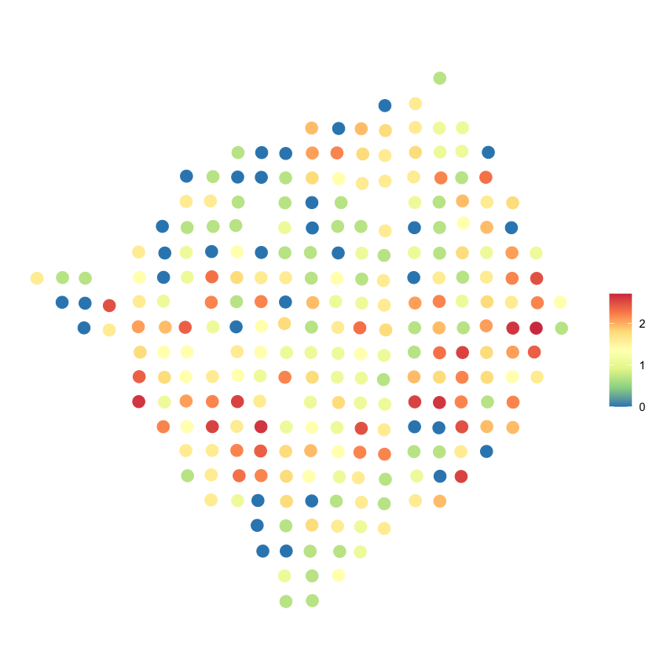

BOOST-GP
=========
Bayesian mOdeling Of Spatial Transcriptomics via Gaussian Process

Introduction
------------
**BOOST-GP** is a Bayesian hierarchical model developed 
to analyze spatial transcriptomics data. It models the gene 
expression count value with zero-inflated negative binomial 
distribution, and estimated the spatial covariance with Gaussian 
process model. It can be applied to detect spatial variable (SV) 
genes whose expression display spatial pattern.

**BOOST-GP** was developed and tested under ``R 3.6.1``. 
The following R packages are required to run the model

-  ``Rcpp``
-  ``RcppArmadillo``
-  ``RcppDist``
-  ``MASS``

Run BOOST-GP on demo data
-------------------------
The following section will guide to run a exemplary data using **BOOST-GP**.

Load BOOST-GP
*************
.. code:: R

   source("R/boost.gp.R")

Load demo data
**************
**BOOST-GP** requires two inputs:

1. a count matrix with each row representing one spatial location, 
and each column representing one gene.

2. a location matrix specifying the x and y coordinates of each 
location.

.. code:: R

   load("data/demo.Rdata")
   head(count_matrix)

+---------------+---------+-------+---------+---------+------+
|               | ARL6IP4 | RPL35 | FAM173A | SNRNP70 | RALY |
+===============+=========+=======+=========+=========+======+
| 17.907x4.967  | 0       | 1     | 0       | 0       | 0    |
+---------------+---------+-------+---------+---------+------+
| 18.965x5.003  | 0       | 1     | 0       | 0       | 4    |
+---------------+---------+-------+---------+---------+------+
| 18.954x5.995  | 0       | 1     | 0       | 0       | 0    |
+---------------+---------+-------+---------+---------+------+
| 17.846x5.993  | 0       | 2     | 0       | 0       | 0    |
+---------------+---------+-------+---------+---------+------+
| 20.016x6.019  | 0       | 3     | 0       | 0       | 0    |
+---------------+---------+-------+---------+---------+------+
| 20.889x6.956  | 0       | 2     | 0       | 1       | 0    |
+---------------+---------+-------+---------+---------+------+

.. code:: R

   head(loc)

+---------------+--------+-------+
|               |      x |     y |
+===============+========+=======+
| 17.907x4.967  | 17.907 | 4.967 |
+---------------+--------+-------+
| 18.965x5.003  | 18.965 | 5.003 |
+---------------+--------+-------+
| 18.954x5.995  | 18.954 | 5.995 |
+---------------+--------+-------+
| 17.846x5.993  | 17.846 | 5.993 |
+---------------+--------+-------+
| 20.016x6.019  | 20.016 | 6.019 |
+---------------+--------+-------+
| 20.889x6.956  | 20.889 | 6.956 |
+---------------+--------+-------+

Run the model
*************
We run ``boost.gp`` with its defaulting setting on the above demo data.

.. code:: R

   res <- boost.gp(Y = count_matrix, loc = loc)

   [1] "Chain 1"
   0% has been done
   10% has been done
   20% has been done
   30% has been done
   40% has been done
   50% has been done
   60% has been done
   70% has been done
   80% has been done
   90% has been done
   [1] "runtime is 146.703s"

Following is the output of ``boost.gp``. ``l`` is the estimated length scale 
of Gaussian process kernel. ``BF`` is the Bayes factor. ``PPI`` is the posterior 
probablity of inclusion. The larger ``BF`` and ``PPI`` are, the stronger the 
confidence of the gene being spatial variable gene is. ``pval`` is the p 
value. Small ``pval`` indicates strong confidence.

.. code:: R

   res

+-----------+---------+--------+---------+-----------+-------+
|           | l       | BF     | PPI     | pval      | time  |
+===========+=========+========+=========+===========+=======+
| ARL6IP4   | 0.0818  |  1.058 | 0.010   | 1.456e-01 | 29.34 |
+-----------+---------+--------+---------+-----------+-------+
| RPL35     | 0.6068  | 17.711 | 0.904   | 2.652e-09 | 29.34 |
+-----------+---------+--------+---------+-----------+-------+
| FAM173A   | 0.0989  |  0.459 | 0.008   | 3.376e-01 | 29.34 |
+-----------+---------+--------+---------+-----------+-------+
| SNRNP70   | 0.0876  |  0.928 | 0.022   | 1.730e-01 | 29.34 |
+-----------+---------+--------+---------+-----------+-------+
| RALY      | 0.0000  |  0.379 | 0.000   | 3.839e-01 | 29.34 |
+-----------+---------+--------+---------+-----------+-------+

Visualize the significant gene
******************************
Based on the above result, RPL35 is a significant spatial variable 
gene, we plot its log transformed expression value to have a visual 
examination.

.. code:: R

   plot.expr(log(count_matrix[,"RPL35"] + 1), loc)

